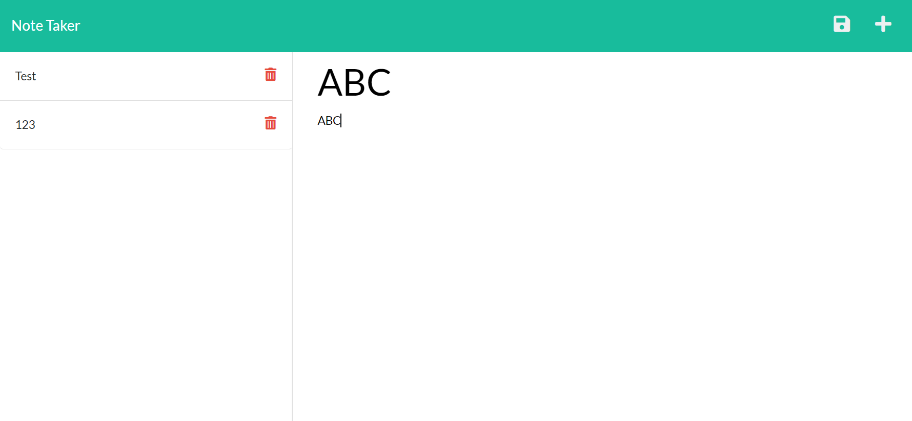

# Module 11 - Note Taker

## Description

This product is designed to create a series of notes for small businesses to keep track of accounts and act like a ToDo list while providing source code for anyone who wishes to view.

## Table of Contents 

* [Installation](#installation-instructions)

* [Usage](#usage-information)

* [License](#license)

* [Contributing](#contributing-guidelines)

* [Tests](#test-instructions)

* [Questions](#questions)

## Installation Instructions

Please follow these steps when running this application.   1. git clone the repository to your local machine.  2. In terminal, CD into your develop folder application.  3. Type and enter 'npm install' to install the dependencies.  4. Type and enter 'node server.js' to run the application.  5. Your finished HTML will be deployed through local host.

## Usage Information

This project should be used to act as a ToDo list, propviding a way for people to take notes on an everyday basis and/or provide an open source code for users to see how to create an application similar to this one.  Deployed at Herkou:   https://m11-note-taker.herokuapp.com/

Sample Page:

## License

MIT: Permissive free license software. Please visit https://opensource.org/licenses/MIT for more information.
  
## Contributing Guidelines

Flipper5001 was the sole contributer for this project. If you wish to make any contributions, please refer to the questions section for our contact information.

## Test Instructions

The original source code for the application was provied, this module was about testing back end procedures.

## Questions

Other works can be found on https://github.com/Flipper5001.

If you have any questions or queries, please contact the following email address and we will get back to you as soon as possible.  
placeholder@gmail.com

